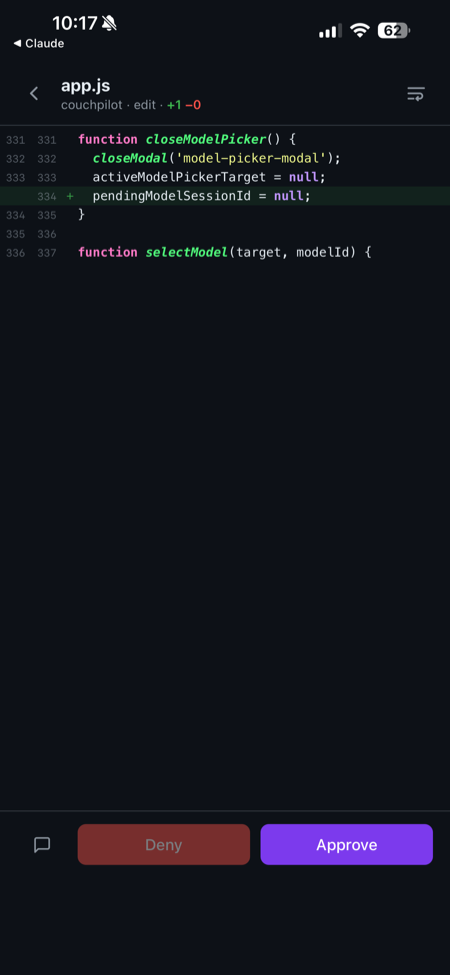
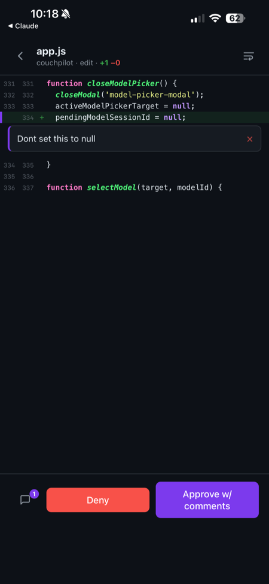
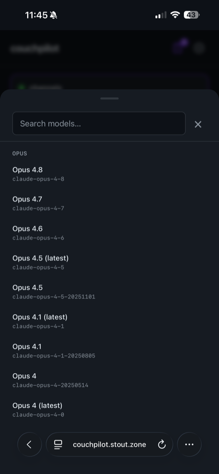
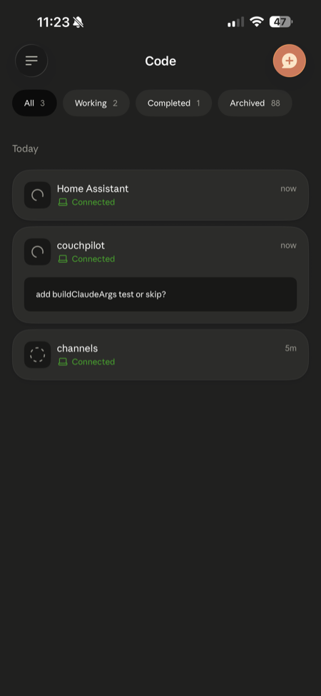
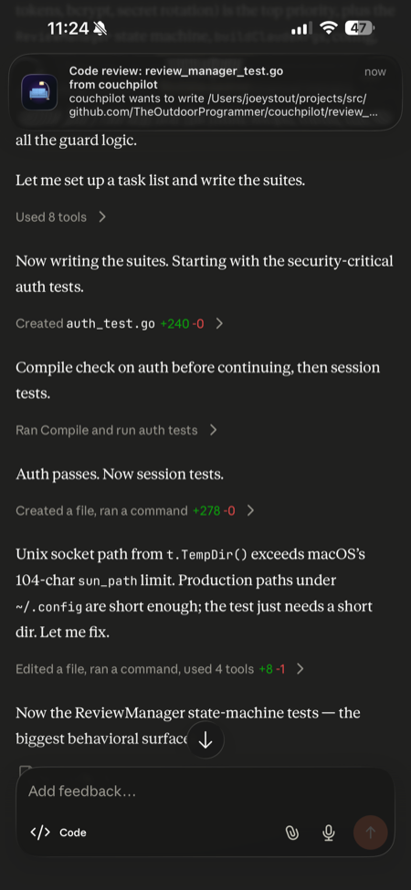

<div align="center">


# couchpilot

**The ultimate mobile vibe-coding cockpit for [Claude Code](https://www.anthropic.com/claude-code).**

Launch, monitor, and steer Claude Code remote-control sessions from your phone, tablet, or any browser — without ever opening a terminal. Built for the couch.

<p>
  
  &nbsp;
  
  &nbsp;
  
</p>

<sub><b>Code review on your phone</b> · tap-to-comment diffs · live model picker — all from the couch.</sub>

</div>

---

## What is couchpilot?

Claude Code can run as a **remote-control session**: a headless agent on your machine that you drive from the Claude mobile app or [claude.ai/code](https://claude.ai/code). The catch is starting and managing those sessions — that still means SSHing in, remembering flags, and babysitting processes from a laptop.

couchpilot is the missing front end. It's a tiny Go service that runs on your dev machine and gives you a **dark, mobile-first web UI** to:

- spin up new Claude Code sessions with the model, effort, permission mode, working directory, and git branch you want — all from a thumb-friendly sheet,
- see every running and recently-ended session at a glance, with live status,
- jump straight into any session in the Claude app, or kill it, with one tap,
- keep a persistent **channels** session alive that bridges a messaging channel (iMessage, or any Claude Code channel plugin) to your agents, so you can message them.

The whole point: you're on the couch, you have an idea, you pull out your phone, and thirty seconds later an agent is working on it. That's the vibe.

> **One binary, no dependencies.** The entire web UI is embedded in the Go binary via `go:embed`. Download it, run it, open the page. That's the install.

---

## Features

- **🚀 One-tap session launch** — pick a project (with live git status), branch, model, effort level, and permission mode from a mobile-native bottom sheet. Create a new branch on the fly.
- **📡 Live session dashboard** — every session with a real-time status dot (starting / active / dead), driven by Server-Sent Events. No refresh button.
- **🔁 Restart-proof sessions** — each session runs under a tiny detached shim process that owns its PTY, so restarting (or upgrading) couchpilot never touches a running session. On startup couchpilot re-adopts every session whose shim is still alive.
- **⏪ Resumable sessions** — dead sessions keep their conversation id and get a **Resume** button: the conversation picks up exactly where it left off, re-registered with Remote Control under the same name.
- **🔍 Full code review** — opt a session into review mode and every file change Claude attempts is held for your approval first: a syntax-highlighted diff on your phone, expandable up/down for more of the surrounding file, tap-to-comment on any line, overall comments, and **Approve** / **Request changes**. Denials feed your comments straight back to Claude, which revises and resubmits.
- **🔔 Push notifications** — get a tappable notification when a review is waiting (requires HTTPS; on iOS, install the app to your home screen first).
- **💬 Channels** — keep a dedicated session alive that bridges a Claude Code **channel** to your agents, so you can message them (iMessage is one plugin; any channel plugin works). If it crashes, it auto-resumes with its conversation context intact; the Restart button starts it fresh.
- **🔐 Password authentication** — on by default, with a one-tap setup. Disable it for a trusted private network if you prefer.
- **📁 Project roots & favorites** — point couchpilot at the folders where your projects live; they show up in the picker with branch, ahead/behind, and dirty-file counts.
- **🧠 Live model catalog & mid-session switching** — the model picker is populated from the latest Claude models, with aliases and a custom-ID escape hatch. Switch the model on a **running** session too — couchpilot relaunches it on the new model with the conversation intact.
- **🔑 Built-in `claude login`** — authenticate Claude Code from the UI via an interactive pseudo-terminal, complete with on-screen arrow/enter/esc keys.
- **🍎 Runs as a macOS service** — one command installs a LaunchAgent that starts on boot and stays up.
- **🧹 Clean process management** — sessions run in their own process group, so killing one reaps its whole child tree (node, MCP servers) instead of orphaning it.

---

## Requirements

- **[Claude Code](https://www.anthropic.com/claude-code)** v2.1.51+ with remote-control support (the `claude` binary must be on your `PATH`).
- A **Claude Pro, Max, Team, or Enterprise** subscription — remote control uses your claude.ai auth, not an API key.
- **macOS** for the `install`/LaunchAgent commands. The server itself is cross-platform (macOS + Linux); only the service installer is macOS-specific.
- **Go 1.26+** only if you're building from source.

---

## Install

### Option 1 — Download a release binary (recommended)

Grab the archive for your platform from the [latest release](https://github.com/TheOutdoorProgrammer/couchpilot/releases/latest), extract it, and put the binary on your `PATH`:

```bash
tar -xzf couchpilot_*_darwin_arm64.tar.gz
sudo mv couchpilot /usr/local/bin/
couchpilot version
```

### Option 2 — `go install`

```bash
go install github.com/TheOutdoorProgrammer/couchpilot@latest
```

### Option 3 — Build from source

```bash
git clone https://github.com/TheOutdoorProgrammer/couchpilot.git
cd couchpilot
go build -o couchpilot .
```

---

## Quick start

```bash
couchpilot
```

Open **http://localhost:7080**. On first run with auth enabled you'll be asked to set a password (or disable auth for a trusted network) — see [Authentication](#authentication).

Override the port:

```bash
couchpilot --port 8080
```

### Run as a macOS service

```bash
couchpilot install
```

This writes a LaunchAgent to `~/Library/LaunchAgents/com.couchpilot.server.plist`, starts it, and keeps it running across reboots. Logs go to `~/.config/couchpilot/stdout.log` and `stderr.log`.

```bash
couchpilot uninstall   # stop and remove the service
```

After rebuilding, restart the running service with:

```bash
launchctl kickstart -k gui/$(id -u)/com.couchpilot.server
```

### CLI reference

| Command | Description |
| --- | --- |
| `couchpilot` | Start the server (foreground). |
| `couchpilot --port <n>` | Start on a specific port. |
| `couchpilot install` | Install & start the macOS LaunchAgent. |
| `couchpilot uninstall` | Stop & remove the LaunchAgent. |
| `couchpilot version` | Print version, commit, and build date. |

---

## Authentication

couchpilot can launch agents that **run arbitrary code on your machine**, so by default it requires a password. The protection is a bcrypt-hashed password plus a signed, HTTP-only, `SameSite=Lax` session cookie that survives restarts (no re-login every time the server bounces). Cross-origin state-changing requests are rejected as CSRF defense-in-depth.

- **First run:** with auth enabled and no password set, the UI shows a one-time setup screen. Set a password, **or** tap *Disable auth (trusted network)* if couchpilot is only reachable on a network you trust.
- **Change / disable later:** **Settings → Security**. Toggle *Require password* off, or set a new password. These changes apply immediately (not on *Save*).
- **Locked out / forgot the password:** delete `~/.config/couchpilot/auth.json` and restart. couchpilot regenerates its signing secret and drops back to first-run setup.

The password hash and signing secret live in `~/.config/couchpilot/auth.json` (mode `0600`), **separate** from `config.json`, and are never exposed through the API.

> ⚠️ couchpilot serves plain HTTP. If you expose it beyond your LAN, put it behind something that terminates TLS, or use a private overlay network like [Tailscale](https://tailscale.com). A password over plain HTTP on the open internet is not enough.

---

## Configuration

Config lives at `~/.config/couchpilot/config.json` and is created with sensible defaults on first run. Most fields are editable from the **Settings** gear in the UI.

```json
{
  "port": 7080,
  "host": "",
  "defaultDir": "~/",
  "favoriteDirs": ["~/", "~/projects/myapp"],
  "projectRoots": ["~/projects/src"],
  "defaultPermissionMode": "bypassPermissions",
  "defaultModel": "",
  "defaultEffort": "",
  "channelsEnabled": false,
  "defaultChannels": "",
  "pluginDirs": [],
  "authEnabled": true
}
```

| Key | Type | Default | Description |
| --- | --- | --- | --- |
| `port` | int | `7080` | HTTP listen port. |
| `host` | string | `""` | Bind address. Empty = all interfaces. Set `127.0.0.1` to restrict to localhost. |
| `defaultDir` | string | `"~/"` | Working directory used when a new session doesn't specify one. |
| `favoriteDirs` | string[] | `["~/"]` | Pinned directories shown at the top of the project picker. |
| `projectRoots` | string[] | — | Parent folders; their immediate subdirectories populate the picker with git status. |
| `defaultPermissionMode` | string | `"bypassPermissions"` | Default Claude permission mode (see below). |
| `defaultModel` | string | `""` | Default model ID (empty = Claude Code's default). |
| `defaultEffort` | string | `""` | Default effort level (`max`, `xhigh`, `high`, `medium`, `low`, or empty). |
| `channelsEnabled` | bool | `false` | Auto-start and supervise the channels session. |
| `defaultChannels` | string | `""` | Channel identifier passed to `--channels`. |
| `pluginDirs` | string[] | — | Local plugin directories loaded via `--plugin-dir` on the channels session. |
| `authEnabled` | bool | `true` | Require a password to use the UI. |

### Permission modes

couchpilot exposes Claude Code's permission modes per session and as a default:

| Mode | Behavior |
| --- | --- |
| `bypassPermissions` | Skips every permission prompt (`--dangerously-skip-permissions`). Maximum vibe, zero friction — and zero guardrails. |
| `acceptEdits` | Auto-accepts file edits, prompts for other actions. |
| `plan` | Plan mode — proposes before acting. |
| `auto` / `dontAsk` / `default` | Standard Claude Code permission behaviors. |

> The UI flags `bypassPermissions` with a warning, because in that mode a launched agent can run any command without asking.

---

## Using couchpilot

### Launch a session

Tap **+ New Session** and fill in the sheet:

- **Title** — optional; auto-generated (e.g. `swift-falcon`) if left blank.
- **Working Directory** — search your favorites and project roots, each shown with branch, ahead/behind arrows, and uncommitted-file count. Or enter a custom path.
- **Branch** — check out an existing branch, or create a new one from a base branch, before the session starts.
- **Permission Mode**, **Model**, **Effort** — default to your configured values; override per session.

Tap **Launch**. couchpilot picks a conversation id for the session, spawns the `claude` process under its shim, and the card appears with a live status dot — green once the TUI reports **Remote Control active**.

### Drive a session

Tap a session card to expand it:

- **Open in Claude** — jumps to the session in the Claude app / claude.ai.
- **Model** — switch the model on a running session. couchpilot relaunches `claude` on the new model under the same conversation id, so the context carries over (handy from a phone, where the Claude app has no model switcher).
- **Kill** — terminates the session (and its child processes).
- **Resume** — on a dead session: relaunches `claude --resume` with the same conversation, name, and settings. Sessions that never exchanged a message have nothing on disk to resume and report an error instead; sessions created before resume support don't show the button.
- **Dismiss** — clears a dead session from the list.

<div align="center">
  
  <br>
  <sub>Sessions couchpilot launched, live in the Claude app — one tap from the dashboard.</sub>
</div>

### Settings

The **gear** opens settings, organized into sections:

- **Session Defaults** — permission mode, model, effort.
- **Projects** — manage project roots and favorite directories.
- **Channels** — enable/configure the channels session.
- **Notifications** — enable push notifications on this device.
- **Security** — password and auth toggle.
- **Claude Account** — run `claude login` from the browser.

Changes are staged and applied on **Save** (except Notifications and Security, which apply immediately).

---

## Code review

Flip **Full code review** on when creating a session (or any time from the session card — it takes effect on the session's next file write, no restart needed). From then on, every `Write`/`Edit`/`NotebookEdit` the session attempts is intercepted **before it touches disk** and shows up as a pending review:

- The session card (and the header) get a **pending review badge**; tap it to open the review.
- The review screen shows a syntax-highlighted, mobile-friendly diff of exactly what Claude wants to change — additions, deletions, and context with both old and new line numbers. New files, oversized files, and edits whose target text no longer matches the file are flagged.
- **Expand the surrounding file** without leaving the review: each collapsed stretch between changes (and above the first / below the last) shows an expand bar — tap **⌃ / ⌄** to peel more context into view above or below, or the line count to reveal the whole stretch. Revealed lines are commentable like any other.
- **Tap any line** to attach a comment to it. The speech-bubble button adds an overall comment. Comments can be deleted until you decide.
- Long lines wrap by default; the **word-wrap toggle** in the header switches to horizontal scrolling with pinned line numbers instead (remembered per device).
- **Approve** lets the write proceed exactly as proposed. With comments attached it becomes *Approve w/ comments*: the change is written and your notes are delivered to Claude as follow-up context.
- **Deny** (requires at least one comment — Claude needs something to act on) blocks the write and hands Claude your comments, quoted line by line. Claude revises and the next attempt comes back as a fresh review.
- Multiple pending reviews queue per session; arrows in the header step through them, and deciding one auto-advances to the next.

While a review is pending, Claude is genuinely blocked mid-tool-call — it waits as long as you take. Pending reviews survive couchpilot restarts (the hook reconnects on its own), and reviews for a session that dies are cancelled.

**Scope honesty:** the gate covers the file tools. Changes made through `Bash` (heredocs, `sed -i`, `git apply`, generators) never pass through the hook, so review mode is a workflow for reviewing Claude's edits — not a security boundary against a malicious agent.

---

## Push notifications

Enable **Settings → Notifications** to get a push when a review is waiting; tapping it deep-links straight into that review. Notifications are per-device subscriptions (VAPID web push, generated and stored locally — no third-party service).

<div align="center">
  
  <br>
  <sub>A push lands the moment a review is waiting — tap it to jump straight in.</sub>
</div>

The browser rules that apply:

- **HTTPS is required.** Service workers and web push only run on a secure origin, so put couchpilot behind whatever TLS-terminating proxy you prefer. Plain `http://host:7080` works fine for everything else, but the Notifications toggle will be unavailable.
- **iOS requires an installed PWA.** In Safari: share menu → **Add to Home Screen**, open couchpilot from the icon, then enable notifications in Settings. iOS 16.4+.
- The service worker is push-only — it deliberately does **no** asset caching, so deploys never serve a stale app.

---

## Channels

Claude Code's **channels** bridge a messaging surface to an agent through a channel plugin. couchpilot can keep a dedicated **channels** session alive for whichever channel you configure (passed through as `--channels <identifier>`): with `channelsEnabled: true` it spawns the session on startup and auto-restarts it if it dies. Enable and configure it under **Settings → Channels**.

Any Claude Code channel plugin works — set `defaultChannels` to its identifier and (for a local plugin) point `pluginDirs` at its source. The walkthrough below uses **iMessage** as a concrete example because it's a forked plugin and needs the extra registration steps; an official/published channel plugin only needs its identifier.

### Example: using a forked iMessage plugin

To use a fork (e.g. `imessage@theoutdoorprogrammer` instead of the official `imessage@claude-plugins-official`), three things are required:

**1. Managed-settings allowlist** (requires sudo):

```jsonc
// /Library/Application Support/ClaudeCode/managed-settings.json
{
  "allowedChannelPlugins": [
    { "marketplace": "theoutdoorprogrammer", "plugin": "imessage" }
  ]
}
```

Claude Code **only** honors `allowedChannelPlugins` from managed settings — putting it in `~/.claude/settings.json` does nothing.

**2. Marketplace registration.** Claude Code resolves `plugin:name@marketplace` by looking up `~/.claude/plugins/marketplaces/<marketplace>/`:

```
~/.claude/plugins/marketplaces/theoutdoorprogrammer/
├── .claude-plugin/marketplace.json    # manifest listing the plugin
└── external_plugins/
    └── imessage -> /path/to/your/fork  # symlink to the fork source
```

Register it in `~/.claude/plugins/known_marketplaces.json`.

**3. couchpilot config:**

```json
{
  "channelsEnabled": true,
  "defaultChannels": "plugin:imessage@theoutdoorprogrammer",
  "pluginDirs": ["/path/to/your/fork"]
}
```

### What doesn't work

- `allowedChannelPlugins` in user settings — silently ignored; managed settings only.
- `--dangerously-load-development-channels` — interactive prompt, unreliable delivery.
- Symlinks in `~/.claude/plugins/cache/` — destroyed on every session start.
- `--plugin-dir` alone without the marketplace — the plugin loads but the channel identifier can't resolve.

---

## How it works

couchpilot never holds a session's PTY itself. Each session is spawned through a tiny detached **shim** (`couchpilot _shim`, the same binary) that is setsid'd into its own process session, so the session's lifetime is decoupled from couchpilot's — restart or upgrade couchpilot and nothing happens to your sessions.

For every session, couchpilot picks a conversation UUID and launches `claude --remote-control <name> --session-id <uuid>` (plus your model/effort/permission/channels flags) under the shim. The shim:

1. owns the PTY master, drains the TUI's output, and auto-accepts the bypass-permissions dialog when that mode is on,
2. watches the ANSI-stripped output for the **Remote Control active** status line (recent Claude Code versions no longer print a session URL; older ones that do get it scraped, legacy-style),
3. maintains `state.json` (phase, claude pid, exit code) atomically and keeps the last 64 KB of output in `tail.log` for debugging,
4. forwards SIGTERM to claude's process group — so killing a session reaps its whole child tree (node, MCP servers, hooks) — and exits when claude exits.

couchpilot watches each shim's state file and pid, broadcasts changes to every browser over **Server-Sent Events**, and persists metadata to `~/.config/couchpilot/sessions.json`. On startup it re-adopts sessions whose shims are still running and marks the rest dead.

**Open in Claude** links start as `https://claude.ai/code/<conversation-uuid>` and are upgraded to the canonical deep link as soon as claude records its Remote Control registration (`bridgeSessionId`) in the session file — the app addresses RC sessions by that id, not the conversation uuid.

Because couchpilot always knows each session's conversation id, a dead session can be **resumed**: `claude --remote-control <name> --resume <uuid>` restores the full conversation and re-registers with Remote Control. Dead sessions stay listed (and resumable) for 24 hours.

### The review gate

Every session is spawned with a generated `--settings` file that wires Claude Code's `PreToolUse`/`PostToolUse` hooks for the file tools to `couchpilot _hook` (the same binary again). The hook is always installed but asks couchpilot whether the session has review mode on — off means an instant allow (~ms), which is why the toggle works mid-session without a respawn.

When review mode is on, the hook submits the tool call to couchpilot, which reads the target file, computes the proposed result (applying `Edit` replacements server-side), and stores a pending review. The hook then long-polls for the verdict — for hours if needed (its configured hook timeout is a day) — while Claude stays blocked inside the tool call. Approval returns `permissionDecision: allow` and the original write proceeds untouched; denial returns the review comments as the decision reason, which Claude receives as the tool failure and iterates on. Approve-with-comments lets the write through and delivers the notes via the `PostToolUse` hook's `additionalContext`, matched by `tool_use_id`.

Hook endpoints authenticate with a dedicated secret (`hook-secret`, passed to sessions via the environment) rather than the UI session cookie. Pending reviews persist to disk, so a couchpilot restart mid-review just looks like a slow poll to the waiting hook. Hook decisions apply even in `bypassPermissions` sessions — hooks sit below the permission system.

### State & files

| Path | Purpose |
| --- | --- |
| `~/.config/couchpilot/config.json` | Configuration. |
| `~/.config/couchpilot/auth.json` | Password hash + signing secret (`0600`). |
| `~/.config/couchpilot/sessions.json` | Persisted session metadata. |
| `~/.config/couchpilot/sessions/<id>/` | Per-session shim state: `state.json`, `tail.log` (last 64 KB of output), `shim.log`, `hooks.json` (generated hook settings), `reviews.json` (review history, capped). Removed when the session is dismissed or ages out. |
| `~/.config/couchpilot/hook-secret` | Shared secret authenticating `_hook` processes to the local API (`0600`). |
| `~/.config/couchpilot/push.json` | VAPID key pair + push subscriptions (`0600`). |
| `~/.config/couchpilot/stdout.log`, `stderr.log` | LaunchAgent logs. |
| `~/Library/LaunchAgents/com.couchpilot.server.plist` | macOS service definition. |

---

## Accessing from your phone

couchpilot binds to all interfaces by default, so on your home network you can reach it at `http://<your-machine>.local:7080` (or its LAN IP). Keep **auth enabled** if anything other than you can touch that network.

For access from anywhere — or to avoid exposing it on a shared LAN — put your machine on a private [Tailscale](https://tailscale.com) network and hit it over the tailnet. Add a TLS-terminating reverse proxy if you want HTTPS.

---

## Troubleshooting

| Symptom | Fix |
| --- | --- |
| **"account not found" / sessions won't start** | Make sure `claude` is on the `PATH` the service sees, and that you've run `claude login`. From the LaunchAgent, `PATH` is `/opt/homebrew/bin:/usr/local/bin:/usr/bin:/bin`. |
| **Locked out of the UI** | Delete `~/.config/couchpilot/auth.json` and restart — back to first-run setup. |
| **Session stuck on yellow/starting** | The shim never saw "Remote Control active" in the TUI output. Check `~/.config/couchpilot/sessions/<id>/tail.log` for what the session is actually showing (login prompt, error, changed status text). |
| **Channels session keeps dying** | Verify the forked-plugin setup above; check `stderr.log` for the spawn error. |
| **Can't reach it from your phone** | Confirm the machine's firewall allows the port and you're on the same network (or tailnet). |

---

## Development

```bash
go build -o couchpilot . && ./couchpilot            # build & run
COUCHPILOT_CONFIG_DIR=/tmp/cp-dev ./couchpilot -port 7099  # isolated dev instance
go vet ./... && gofmt -l .                           # lint
go test -race ./...                                  # tests (race detector)
```

Tests run in CI on every pull request and push to `main` (`.github/workflows/test.yml`: gofmt, vet, build, `go test -race`).

Per-session output lives in `~/.config/couchpilot/sessions/<id>/tail.log` (rolling, bounded), which replaces the old `COUCHPILOT_DEBUG` firehose.

The web UI lives in `static/` and is embedded into the binary at build time, so a plain `go build` produces a self-contained executable — no asset bundling step.

### Project layout

| File | Responsibility |
| --- | --- |
| `main.go` | CLI entry point, LaunchAgent install/uninstall, version. |
| `server.go` | HTTP server, routes, SSE hub, auth middleware, config API. |
| `session.go` | Session lifecycle — shim spawn, state watching, resume, model switch, persistence. |
| `shim.go` | Detached per-session PTY owner — output scanning, state file, input socket, signal forwarding. |
| `review.go` | Code-review state machine, diff engine, and persistence. |
| `hook.go` | `couchpilot _hook` — the `PreToolUse`/`PostToolUse` bridge that gates file writes. |
| `push.go` | VAPID web-push key management, subscriptions, and delivery. |
| `auth.go` | Password hashing, signed cookie tokens, auth storage. |
| `config.go` | Config load/save. |
| `login.go` | Interactive `claude login` over a PTY. |
| `projects.go` | Project discovery + cached git status. |
| `models.go` | Live Claude model catalog. |
| `static/` | Embedded SPA (`index.html`, `app.js`, `style.css`). |
| `*_test.go` | Unit tests (run with `go test -race ./...`). |

---

## Releasing

Releases are automated with [GoReleaser](https://goreleaser.com) and GitHub Actions. The **tag is the version** — it's injected into the binary (`couchpilot version`) and shown in the UI.

```bash
git tag v1.2.3
git push origin v1.2.3
```

Pushing a `v*` tag triggers `.github/workflows/release.yml`, which **runs the full test suite first** and only proceeds if it passes, then cross-compiles macOS and Linux binaries (amd64 + arm64), archives them with checksums, and publishes a GitHub Release. Validate the config locally with `goreleaser check` or do a dry run with `goreleaser release --snapshot --clean`.

---

## License

[MIT](LICENSE) © Joey Stout
